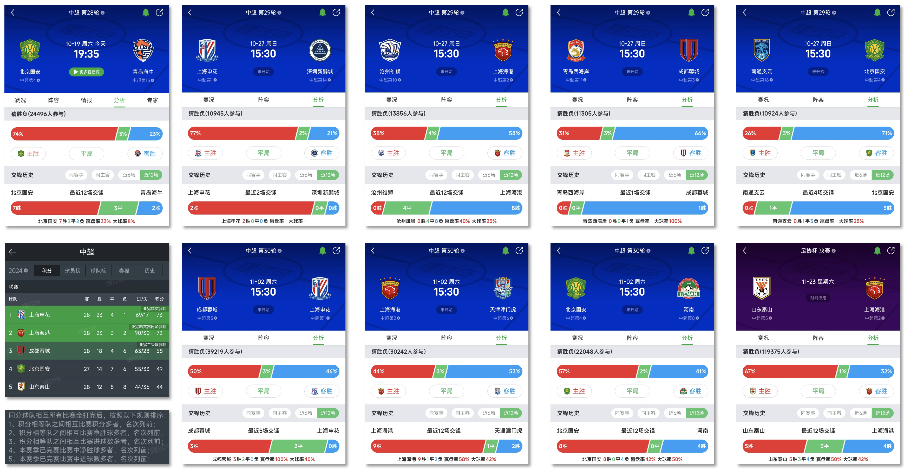

# 中超联赛2024仿真
* 中超联赛接近尾声, 最终是申花还是海港问鼎冠军? 成都蓉城目标亚洲的目标能否实现？
* 我在2024.10.19日, 国安和海牛的比赛开始前写了一个小程序, 根据懂球帝上球迷们猜胜负的数据, 以及交锋历史数据进行“仿真”.
* 仿真1000000次, 共12040个结局, result.txt中记录了概率比较高的结局(累加起来有95%).
* 在2024.11.23足协杯决赛结束后, 看最终结局是否在result.txt中.

## 仿真结果
* 申花联赛冠军概率61.74%
* 海港联赛冠军概率38.26%
* 蓉城亚冠精英赛附加赛区概率44.19%
* 蓉城亚冠二级联赛区概率55.61%
* 蓉城无缘亚冠概率0.19%
